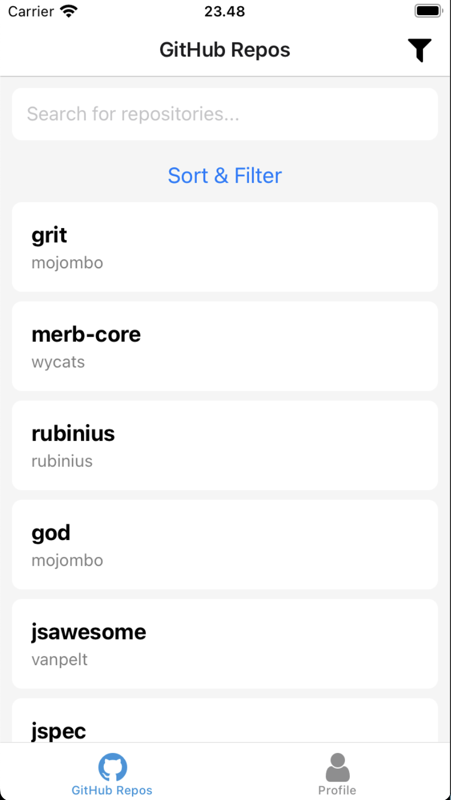
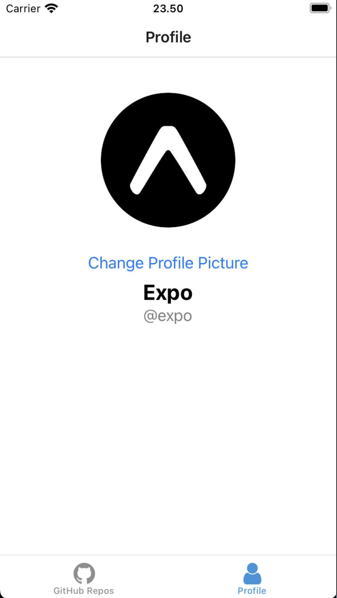

## ✨ Key Features

* **Infinite Scroll:** Seamlessly browse through an endless list of public repositories.
* **Live Search:** A debounced search bar provides instant results as you type.
* **Client-Side Filtering:** A modal popup allows for sorting the displayed repositories by name (Ascending/Descending).
* **Dynamic User Profiles:** Tap on a repository to view the owner's profile details, fetched on-demand.
* **Simulated Photo Upload:** A dedicated "My Profile" tab demonstrates local image picking using `expo-image-picker`.
* **Modern State Management:** Uses **Redux Toolkit Query (RTK Query)** for efficient data fetching, caching, and server state management, eliminating boilerplate.
* **Type-Safe:** Fully written in **TypeScript** to ensure code quality and reduce runtime errors.
* **Tested:** Includes unit tests for components and API logic using **Jest**, **React Native Testing Library**, and **Mock Service Worker (MSW)**.

---

## 📸 Screenshots

*(Replace these with your own screenshots after running the app)*






---

## 🛠️ Tech Stack

* **Framework:** React Native with Expo
* **Routing:** Expo Router (File-based)
* **State Management:** Redux Toolkit with RTK Query
* **Language:** TypeScript
* **API Client:** Axios (used by RTK Query's `fetchBaseQuery`)
* **Testing:** Jest, React Native Testing Library, Mock Service Worker (MSW)
* **UI & Components:** `expo-image-picker` for local image access

---

## ⚙️ Getting Started

Follow these instructions to get the project up and running on your local machine.

### Prerequisites

* Node.js (LTS version recommended)
* Expo Go app on your iOS or Android device, or a running simulator/emulator.

### Installation

1.  **Clone the repository:**
    ```bash
    git clone <your-repo-url>
    cd <your-repo-folder>
    ```

2.  **Install dependencies:**
    ```bash
    npm install
    ```

---

## ▶️ Running the Application

1.  **Start the development server:**
    ```bash
    npx expo start
    ```

2.  **Open the app:**
    * **On your phone:** Scan the QR code displayed in the terminal using the Expo Go app.
    * **On a simulator/emulator:** Press `i` in the terminal to open the iOS Simulator or `a` to open the Android Emulator.

---

## ✅ Running Tests

To run the unit tests and see the coverage report, use the following command:

```bash
npm test
```